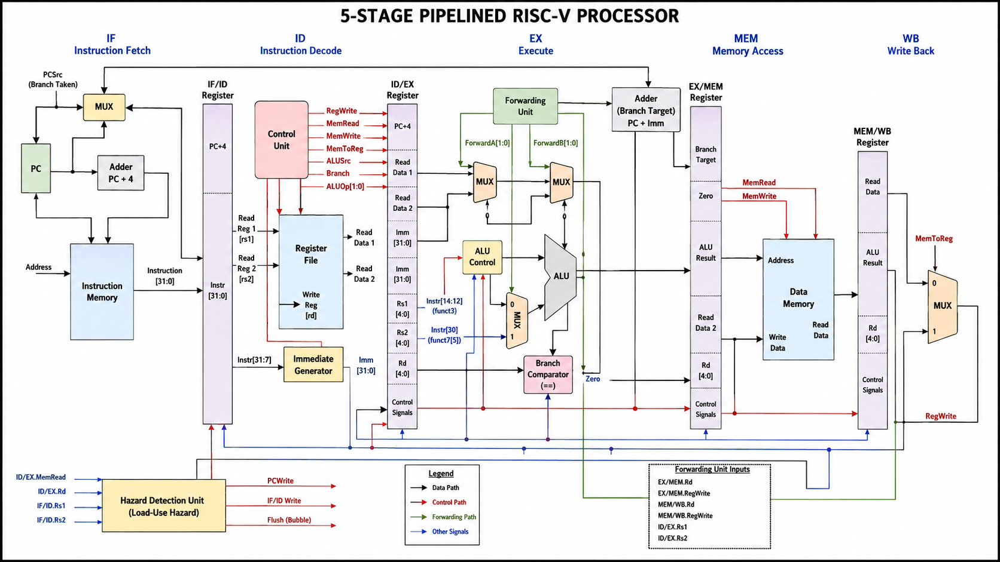
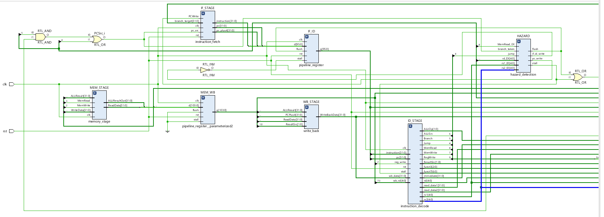
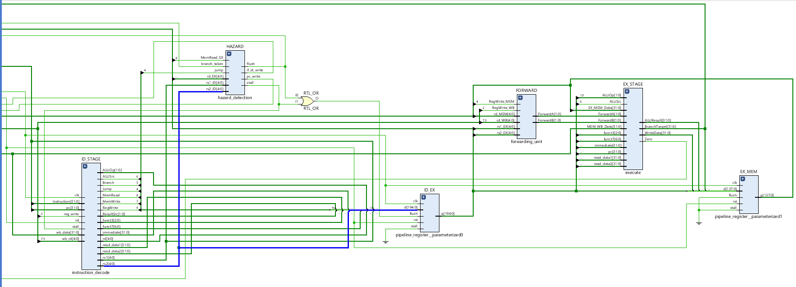
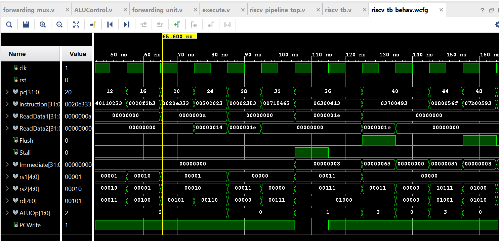
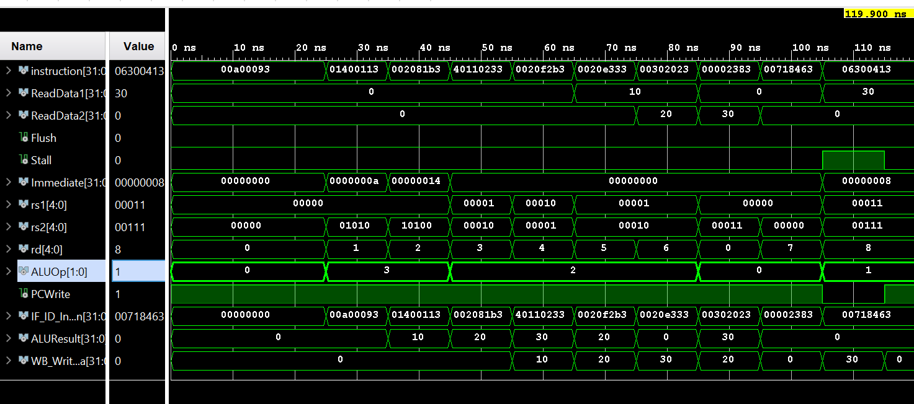
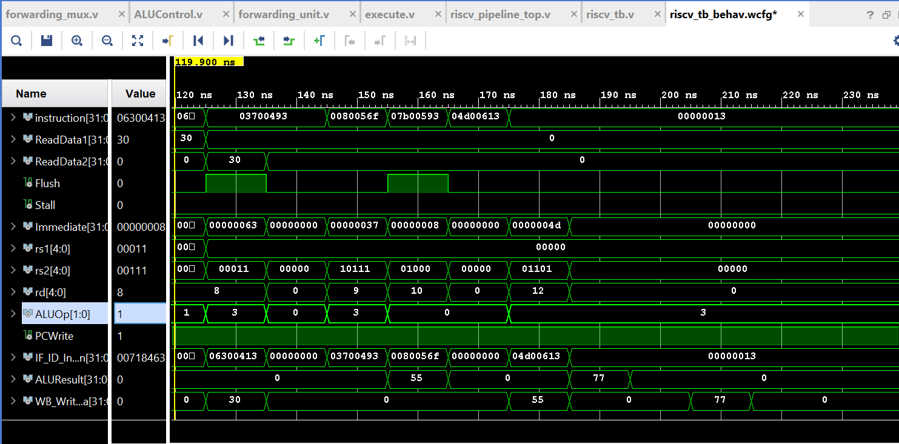
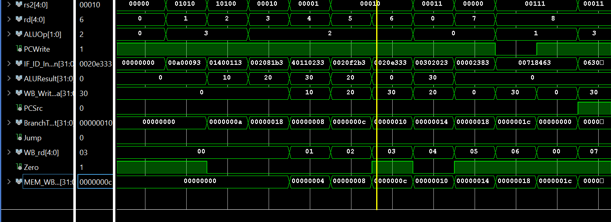

<p align="center">
  
</p>

<h1 align="center">
RISC-V Pipeline Processor
</h1>

<p align="center">
A 5-Stage Pipelined RISC-V Processor in Verilog HDL
</p>

## 📖 Project Overview

This project implements a **5-stage pipelined RISC-V processor** in **Verilog HDL**. The processor executes RISC-V instructions using the classic pipeline stages and incorporates hazard detection and forwarding techniques to improve execution efficiency while maintaining correct program behavior.

The design was developed and simulated using **Xilinx Vivado** as part of a Computer Architecture project.

---

## ✨ Features

- 5-stage pipelined RISC-V processor
- Verilog HDL implementation
- Hazard Detection Unit
- Forwarding Unit
- Pipeline Registers
- Branch handling
- Instruction Fetch (IF)
- Instruction Decode (ID)
- Execute (EX)
- Memory Access (MEM)
- Write Back (WB)
- Simulation in Xilinx Vivado

---

## 📐 RTL Schematic

The RTL schematic generated in Xilinx Vivado illustrates the structural organization of the pipelined processor and the interconnection of its hardware modules.

### RTL Schematic (Part 1)



### RTL Schematic (Part 2)


---

## 📊 Simulation Waveforms

The following simulation waveforms were generated using **Xilinx Vivado** to verify the functionality of the pipelined RISC-V processor. These waveforms demonstrate correct instruction execution, pipeline register operation, hazard handling, and write-back behavior.

### Waveform 1



### Waveform 2



### Waveform 3



### Waveform 4


---
---

## 📈 Results

Simulation results confirm the correct functionality of the pipelined processor, including:

- Successful execution of arithmetic and logical instructions
- Correct load and store operations
- Proper register write-back
- Data hazard resolution through forwarding
- Hazard detection and pipeline stalling when required
- Correct pipeline stage operation verified through simulation waveforms
## 📂 Project Structure

```text
RISCV-Pipeline-Processor/
│
├── images/                     # README images
├── ALU.v                       # Arithmetic Logic Unit
├── ALUControl.v                # ALU control logic
├── ControlUnit.v               # Main control unit
├── Data.hex                    # Data memory initialization
├── Program.hex                 # Instruction memory initialization
├── RamSp.sv                    # Single-port RAM
├── RegisterFile.v              # Register file
├── execute.v                   # Execute stage
├── forwarding_mux.v            # Forwarding multiplexer
├── forwarding_unit.v           # Data forwarding unit
├── hazard_detection.v          # Hazard detection unit
├── immediateGenerator.v        # Immediate value generator
├── instructionDecoder.v        # Instruction decoder
├── instruction_decode.v        # Instruction Decode stage
├── instruction_fetch.v         # Instruction Fetch stage
├── memory_stage.v              # Memory stage
├── pipeline_register.v         # Pipeline registers
├── programCounter.v            # Program counter
├── Memory.v                    # Data memory module
├── riscv_pipeline_top.v        # Top-level processor
├── riscv_tb.v                  # Testbench
├── write_back.v                # Write Back stage
└── README.md                   # Project documentation
```
---

## ⚙️ Pipeline Stages

The processor follows the classic **5-stage RISC-V pipeline** to improve instruction throughput by executing multiple instructions simultaneously.

### 1. Instruction Fetch (IF)
- Fetches the instruction from instruction memory.
- Updates the Program Counter (PC) to the next instruction.

### 2. Instruction Decode (ID)
- Decodes the fetched instruction.
- Reads source operands from the Register File.
- Generates the immediate value and control signals.

### 3. Execute (EX)
- Performs arithmetic and logical operations using the ALU.
- Calculates memory addresses for load/store instructions.
- Evaluates branch conditions.
- Uses the Forwarding Unit to resolve data hazards whenever possible.

### 4. Memory Access (MEM)
- Reads data from memory for load instructions.
- Writes data to memory for store instructions.
- Passes ALU results for instructions that do not access memory.

### 5. Write Back (WB)
- Writes the final result back to the destination register.
- The result may come from either the ALU or the Data Memory depending on the instruction type.
---

## 🛠️ Tools Used

- **Verilog HDL** – Hardware description language used to design the processor.
- **Xilinx Vivado** – Design, simulation, and RTL schematic generation.
- **Git** – Version control.
- **GitHub** – Source code hosting and project documentation.
- **Visual Studio Code** – Source code editor.
---

## 🚀 How to Run
### Prerequisites

- Xilinx Vivado
- Verilog HDL support
- Git (optional for cloning)

### Steps

1. Clone the repository.

```bash
git clone https://github.com/sarawaheed-33/Riscv-Pipeline-Processor.git
```

2. Open the project in Xilinx Vivado.

3. Add all Verilog source files.

4. Load:

- Program.hex
- Data.hex

5. Set `riscv_tb.v` as the simulation top.

6. Run Behavioral Simulation.

## 🌟 Future Improvements

- Add support for additional RISC-V instructions.
- Improve branch prediction.
- Introduce instruction and data caches.
- Optimize hazard handling techniques.
- Implement performance monitoring counters.
---

## 👩‍💻 Author

**Sara Waheed**

- GitHub: https://github.com/sarawaheed-33
---

## 📄 License

This project is licensed under the MIT License. See the LICENSE file for details.
